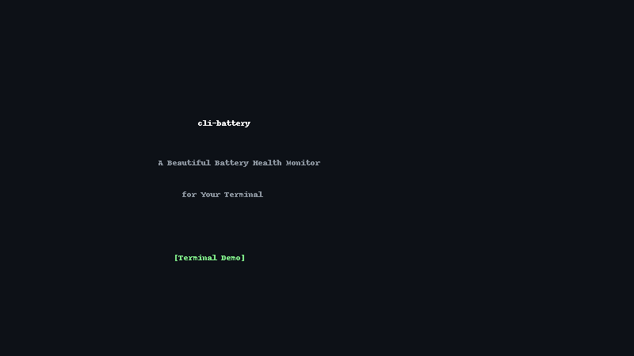

# 🔋 cli-battery

[](https://github.com/zoe668668/cli-battery/releases)
[](https://opensource.org/licenses/MIT)
[](https://github.com/zoe668668/cli-battery)
[](https://goreportcard.com/report/github.com/zoe668668/cli-battery)

> **A beautiful battery health monitor for your terminal** 🔋✨

A lightweight, zero-dependency CLI tool to monitor your laptop battery health, cycle count, temperature, and estimated lifespan with beautiful terminal graphics.



## ✨ Features

- 📊 **Battery Health Score** - Visual health percentage with color coding (green/yellow/red)
- 🔄 **Cycle Count** - Track charge cycles vs. design limit
- 🌡️ **Temperature Monitor** - Real-time battery temperature
- ⏱️ **Time Estimates** - Time to full charge / time remaining
- 📈 **Pretty Charts** - ASCII progress bars
- 🖥️ **Cross-Platform** - macOS & Linux support
- ⚡ **Zero Dependencies** - Single binary, no runtime required
- 🎨 **Color Themes** - Multiple color schemes (default, neon, dark, minimal)

## 📦 Installation

### macOS

```bash
curl -sSL https://github.com/zoe668668/cli-battery/releases/latest/download/cli-battery-darwin-arm64 -o cli-battery
chmod +x cli-battery
./cli-battery
```

### Linux

```bash
curl -sSL https://github.com/zoe668668/cli-battery/releases/latest/download/cli-battery-linux-amd64 -o cli-battery
chmod +x cli-battery
./cli-battery
```

## 🚀 Quick Start

```bash
# Basic usage - show battery status
cli-battery

# Watch mode - update every 5 seconds
cli-battery --watch

# JSON output for scripting
cli-battery --json

# Show with neon theme
cli-battery --theme neon
```

## 🛠️ Building from Source

```bash
git clone https://github.com/zoe668668/cli-battery.git
cd cli-battery
go build -o cli-battery .
./cli-battery
```

## 🤝 Contributing

Contributions are welcome! Please feel free to submit a Pull Request.

## 📝 License

MIT License - see the [LICENSE](LICENSE) file for details.

---

⭐ **If this project helped you, please consider giving it a star!** ⭐
